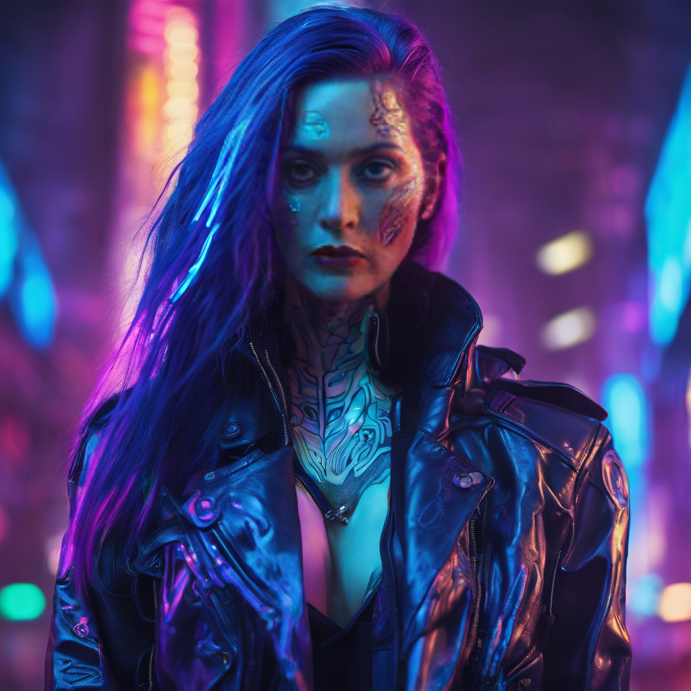
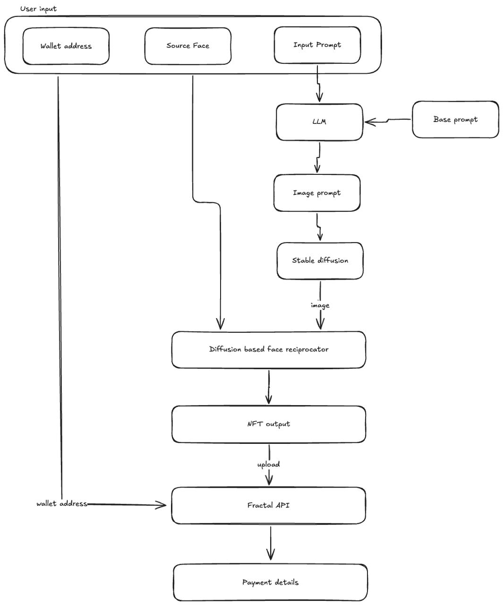

# NFTGen v0.1.0

Create consistent images with consistent face with Generative AI.
This fixes the biggest problem with generative AI, the lack of consistency.

This project enables anyone to generate and launch their own NFT collection with the magic of AI.

Example: A Kate Winslet NFT generate in cyberpunk world setting



# Strengths
* Capable of making any face into NFT Art
* Consistent image generation
* Anyone can quickly create own NFT collection by turning a face into prompt defined art
* Prompt based customisation
* Efficient system design and architecture, minimal cost
* Integrated with Fractal
* Compliant image size with required standards
* Cost effective execution

# Areas of future work
* Only select animal faces can be used as NFT
* Tkinter based interface, not optimized for web yet
* User need to run the project on a PC with decent hardware
* Web interface needed for more traction and seamless connection
* Non face based NFT support needs to be added
* Can further optimize the project to increase speed and concurrency

## System Architecture



## Setup

1. Install the required packages
```bash
pip install -r requirements.txt
```
2. Input environment variables

3.Run the script
```bash
python run.py --execution-provider cpu 
```

4. Enter walled address, Select a face and enter your prompt

5. Click on Generate

6. Pay the amount and receive the NFT in your own wallet